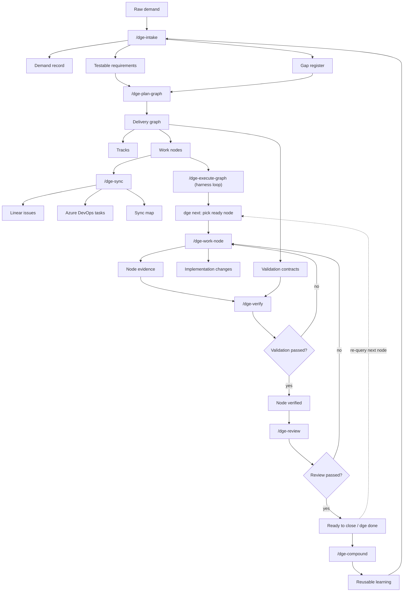

# Delivery Graph Engineering

**The neutral ground where any agent's work is proven, not trusted.**

Claude Code, Copilot CLI, Kimi — whatever coding agent you use, it works against **one
evidence-gated delivery graph**, and `done` is **enforced by the engine, not claimed by the
agent**. A node cannot reach `done` until its validation evidence exists on disk. The tool
decides completion; the agent doesn't get to say "it's done" and be believed.

### Why this is different

Every coding agent today trusts *itself* to declare work complete — and agents are
documented to over-report "done." In DGE, completion is a **state-machine invariant**:
`verified` can only be minted by running `dge verify` against real evidence, and `done`
requires `verified`. There is no path — not even a "quiet" or automated one — that reaches
`done` without proof. That check is the same regardless of which agent produced the work,
which is what makes DGE **neutral ground**: an objective arbiter any agent's output must pass.

- **Harness-agnostic.** The `dge` CLI is a plain binary and `graph.json` is a plain file, so
  Claude Code, Copilot CLI, and others read and write the *same* delivery graph. DGE rides on
  top of harnesses; it is not itself a harness.
- **Done means proven.** Evidence-gated completion is enforced in the engine, not left to the
  agent, the user, or CI.
- **Persistent, machine-readable graph.** Demands → requirements → tracks → nodes with real
  dependency edges and validation contracts, versioned in `graph.json` — the source of truth
  harnesses treat as ephemeral.
- **Compounds across demands.** Completed work leaves behind evidence and learnings that the
  next intake reads, so the toolset gets smarter with each demand.

> **Built for what no single harness can do.** Because the ground is neutral and completion is
> objective, DGE is designed toward *different agents building and verifying each other's work
> against one source of truth*. That parallel, cross-agent validation is on the
> [roadmap](ROADMAP.md) — the substrate (harness-neutral CLI + shared graph + objective gate)
> exists today; concurrency-safe storage and a cross-agent verify role are what make it fully
> real. See [ROADMAP.md](ROADMAP.md) for what ships today vs. what's coming.

DGE also brings the general discipline every serious agentic workflow needs — clarify before
coding, plan before execution, work in isolated units, validate before completion, review
before merge, capture learnings — and models delivery as a **graph** rather than a linear
checklist. But the discipline is table stakes; the enforced, evidence-gated, agent-neutral
`done` is the point.

## 60-second quickstart

Add DGE to any repo and drive one node from demand to evidence-gated `done`:

```bash
# 1. Install the CLI and the /dge-* slash commands
npm install --save-dev github:rafaelolsr/delivery-graph
npx dge install-skills                 # auto-detects .claude/ or .github/

# 2. Create the canonical graph store
npx dge init --title "My delivery graph"

# 3. Author one demand -> requirement -> node
npx dge add-demand --title "Safer releases" --source "user" --outcome "Every completed node has proof"
npx dge add-requirement --demand DEM-001 --statement "Nodes require validation evidence" --acceptance "Verify fails without evidence" --evidence "Evidence manifest"
npx dge add-track --title "Validation"
npx dge add-node --title "Add evidence gate" --type test --track TRK-validation --requirements REQ-001 --validation "npm test"

# 4. Capture proof and close the node (fails without passing evidence)
npx dge evidence run NODE-001 --satisfies "npm test" -- npm test
npx dge done NODE-001
npx dge status --save
```

This runs **fully locally** — no Linear, Azure DevOps, or credentials required. Tracker sync
(`dge sync linear|ado`) is dry-run only today: it writes a reviewable payload under
`delivery-graph/sync/` and never calls an external API. New here? Read
[docs/getting-started.md](docs/getting-started.md) for the guided walkthrough.

## Core idea

```text
                                           /dge-execute-graph  (drives the inner loop, on dge next)
                                           |---------------------------------|
                                           v                                 v
Intake -> Requirements -> Graph -> Sync -> Work Node -> Verify -> Review -> done
   ^                                                                          |
   |------------------------------ Compound ----------------------------------|
```

Two loops compound the work. The **inner loop** — `/dge-execute-graph`, built on the
read-only `dge next` accessor — drives `Work Node -> Verify -> Review -> done` one ready
node at a time, re-querying `dge next` after each node so completing one can unblock the
next. The **outer loop** compounds across demands: every completed node leaves behind
validation evidence, decisions, reusable patterns, and follow-up context for the next demand.

## Quick start

DGE has **two surfaces** that install through **two different channels**:

- the **`dge` CLI** (evidence gates, `init`, `status`, `next`, `done`, `brief`, …) — an
  **npm package**; and
- the **`/dge-*` skills** (the slash commands) — **prompts**, installed per-project or via
  the plugin marketplace.

The skills *call* the CLI, so **you always need the CLI**. A marketplace install alone gives
you the slash commands but no engine — they will stop at preflight until the CLI is installed.

### Complete install (recommended)

Self-contained for one project — CLI, skills, and store, all wired:

> On a locked-down corporate/Windows machine and hitting `npm error code E401`? Jump to
> [Troubleshooting: E401 on a corporate machine](#troubleshooting-npm-error-code-e401-unable-to-authenticate-on-a-corporate-machine)
> — pointing the install at the public registry fixes it.

```bash
# 1. the CLI (npm) — required
npm install --save-dev github:rafaelolsr/delivery-graph

# 2. the /dge-* skills into your harness (.claude/ or .github/)
npx dge install-skills --harness claude --symlink

# 3. the canonical graph store
npx dge init --title "My delivery graph"
```

Then reload skills in Claude Code (restart the session or `/reload-plugins`). Pass
`--harness claude|copilot` to choose explicitly, drop `--symlink` to copy instead, or
`--force` to overwrite.

### Troubleshooting: `npm error code E401 Unable to authenticate` on a corporate machine

DGE is a **public MIT repo fetched over git** (`github:rafaelolsr/delivery-graph`) — it is not
on the npm registry and needs no credentials. An `E401` here is **your environment, not this
package**: a corporate `~/.npmrc` (`%USERPROFILE%\.npmrc` on Windows) with `always-auth=true`
and/or a stale registry token forces npm to authenticate *every* request, including this public
git fetch. Try these in order — each is a single command or project-local file; **none require
editing the corporate global config**:

**1. Point at the public registry for the install** — this is the fix that has worked on a
locked-down corporate Windows machine. Installing globally (`-g`) puts `dge` on your PATH
directly, so you don't need `npx` or a project first:

```bash
npm install -g github:rafaelolsr/delivery-graph --registry=https://registry.npmjs.org/
# then verify:
dge preflight --no-graph
```

Prefer a project-local dev dependency instead? The same override works with `--save-dev`
(then use `npx dge ...`):

```bash
npm install --save-dev github:rafaelolsr/delivery-graph --registry=https://registry.npmjs.org/
```

If it still fails, add `--always-auth=false` to the command — that overrides a corporate
`always-auth=true` for this one install.

**2. Skip npm's registry path entirely — clone + local install** (for when even
`registry.npmjs.org` is unreachable through the corporate proxy; delivers **both** the CLI and,
via `npx dge install-skills`, the skills):

```bash
git clone https://github.com/rafaelolsr/delivery-graph.git
cd delivery-graph && npm install --ignore-scripts
# then, from YOUR project (this path assumes the clone sits beside it):
npm install --save-dev "file:../delivery-graph"
```

**3. Use npm's git resolver** instead of the GitHub-shorthand tarball fetch that some proxies
gate:

```bash
npm install --save-dev git+https://github.com/rafaelolsr/delivery-graph.git
```

**4. Inspect what config is forcing auth** (on Windows use `findstr`, not `grep`):

```bash
npm config get always-auth       # true here is the culprit
npm config get registry          # a corporate mirror, not registry.npmjs.org
npm config list -l | findstr auth
```

If `always-auth=true` comes from your user config, override it **per project** — without touching
the corporate global config — by adding an `.npmrc` next to your `package.json` containing
`always-auth=false`.

Once the CLI is installed, add the `/dge-*` skills to your harness and create the store — from
your project directory:

```bash
dge install-skills          # copies the /dge-* skills into .claude/ or .github/
dge init --title "My delivery graph"
```

**Can't run npm at all?** You can still get the `/dge-*` slash commands via the
[marketplace](#optional-get-the-skills-globally-via-the-marketplace) — but the marketplace ships
**prompts, not the CLI**, so the `dge` binary the skills call still has to come from options 1–3
above (or a machine where npm works). Skills without the CLI stop at preflight.

### Optional: get the skills globally via the marketplace

The marketplace installs the `/dge-*` skills **globally across all your Claude Code / Copilot
CLI projects**, instead of copying them into one repo. Its one benefit is cross-project skill
availability; its one caveat is that it ships **prompts, not the binary**, so you **still run
steps 1 and 3 above** (the npm CLI install and `dge init`) in each project that owns a store.

**Claude Code:**

```text
/plugin marketplace add rafaelolsr/delivery-graph
/plugin install delivery-graph@dge-tools
/reload-plugins
```

**GitHub Copilot CLI** (the standalone `copilot`, installed via `npm install -g @github/copilot`) —
manage plugins with the `/plugin` slash command **inside the `copilot` prompt** (note the leading
`/`; without it the text is sent to the model as a normal prompt). Open the plugin UI with `/plugin`
and add `rafaelolsr/delivery-graph` from the marketplace UI (inline
`/plugin marketplace add rafaelolsr/delivery-graph` also works if your version supports it).

Both harnesses read the same `.claude-plugin/plugin.json` at the repo root and auto-scan the
top-level `skills/` directory. Skills appear namespaced (e.g. `/delivery-graph:dge-intake`).
With the marketplace handling skills, use `npm install … && npx dge init` for the CLI + store;
you can skip `dge install-skills`.

The shortest end-to-end loop is:

```bash
npx dge add-demand --title "Safer releases" --source "user" --outcome "Every completed node has proof"
npx dge add-requirement --demand DEM-001 --statement "Nodes require validation evidence" --acceptance "Verify fails without evidence" --evidence "Evidence manifest"
npx dge add-track --title "Validation"
npx dge add-node --title "Add evidence gate" --type test --track TRK-validation --requirements REQ-001 --validation "npm test"
npx dge evidence run NODE-001 --satisfies "npm test" -- npm test
npx dge done NODE-001
npx dge status --save
```

For local DGE development, run:

```bash
npm run check
```

This validates the example graph against the JSON Schema and semantic graph rules, renders a status report, and runs the tests.

## Local engine commands

The MVP includes a local graph engine and CLI.

```bash
# Validate a graph
npm run validate

# Render graph status
npm run status

# Save graph status for handoff or review
npx dge status --save
npx dge status --out delivery-graph/reports/status.md

# Show the next ready node (dependency-aware queue head)
npx dge next
npx dge next --json

# Run engine tests
npm test

# Transition a node in a graph file
npm run transition -- examples/delivery-graph.example.json NODE-001 done
```

The transition command enforces the node state machine, dependency readiness, and validation evidence requirements.

## Authoring commands

Use the `dge` CLI to create and edit a local graph without hand-writing JSON.

```bash
# Create the canonical graph
npx dge init --title "Advisor eval regression gate"

# Add intake outputs
npx dge add-demand --title "Safer eval gates" --source "user" --outcome "Block quality regressions before merge"
npx dge add-requirement --demand DEM-001 --statement "PRs fail when eval quality drops" --acceptance "CI fails below threshold" --evidence "CI check output"
npx dge add-gap --type validation --severity blocker --question "What threshold blocks a PR?" --blocks REQ-001
npx dge resolve-gap GAP-001 --resolution "Use the current baseline threshold"

# Add plan graph outputs
npx dge add-track --title "Validation"
npx dge add-node --title "Add eval CI command" --type implementation --track TRK-validation --requirements REQ-001 --validation "npm test"

# Inspect and move work
npx dge status
npx dge next
npx dge transition NODE-001 in_progress

# Project ready nodes to a tracker as a dry-run sync map
npx dge sync linear --team-id "<linear-team-id>"
npx dge sync ado --org "<ado-org>" --project "<ado-project>" --area "<area-path>" --iteration "<iteration-path>"
```

By default, `dge` reads and writes `delivery-graph/graph.json`. Pass `--graph <path>` to target another graph file.

Linear sync writes `delivery-graph/sync/linear.json`; Azure DevOps sync writes `delivery-graph/sync/ado.json`. Both adapters are intentionally dry-run: they create deterministic tracker payloads and sync state without requiring credentials.

## Usable local loop

The local loop works without Linear, Azure DevOps, or any external tracker:

```bash
npx dge init --title "My delivery graph"
npx dge add-demand --title "Safer releases" --source "user" --outcome "Every completed node has proof"
npx dge add-requirement --demand DEM-001 --statement "Nodes require validation evidence" --acceptance "Verify fails without evidence" --evidence "Evidence manifest"
npx dge add-track --title "Validation"
npx dge add-node --title "Add evidence gate" --type test --track TRK-validation --requirements REQ-001 --validation "npm test"
npx dge evidence run NODE-001 --satisfies "npm test" -- npm test
# Browser/UX evidence can be captured with Playwright:
# npx dge evidence playwright NODE-001 --satisfies "checkout works" --url http://localhost:3000 --script tests/e2e/checkout.spec.ts
npx dge done NODE-001
npx dge status --save
```

This creates:

```text
delivery-graph/
├── graph.json                    # single source of truth (structure, DAG, status)
├── demands/
│   └── DEM-001/                  # everything a demand generates lives under it
│       ├── DEM-001.md
│       ├── requirements/REQ-001.md
│       └── evidence/
│           └── NODE-001/         # nodes are scoped to their one owning demand
│               ├── evidence.json
│               ├── summary.md
│               └── verification.md
└── reports/
    ├── review-<timestamp>.md
    └── status-<timestamp>.md
```

The store is demand-centric: a node belongs to exactly one demand, and everything derived
from a demand (its requirements and its nodes' evidence) lives under `demands/DEM-###/`. The
folder tree is a materialized projection of `graph.json` — `dge regenerate` rebuilds it,
`dge show DEM-###` renders one demand's tree, and `dge remove-demand DEM-###` retires a demand
(folder + graph records) in one step.

`dge validate` runs both the published JSON Schema and the semantic graph checks: cross references, unresolved blocker gaps, dependency cycles, dependency readiness, and validation evidence rules.

## Autonomous execution loop

When a plan produces many nodes, you do not have to drive each one by hand. DGE separates the loop into two layers:

- **`dge next`** is a read-only queue accessor. It returns the next ready node — one whose status is `ready` and whose dependencies are all `done` — in graph order, or `null` when none are ready. It never implements work.
- **`/dge-execute-graph`** is the skill that drives the loop through your harness's agent: it calls `dge next`, implements the node with `/dge-work-node` discipline, captures evidence, and closes it through the evidence-gated `dge done`. Completing a node can unblock its dependents, so the queue is re-queried after every node.

```bash
# The queue accessor the loop is built on
npx dge next --json
# => { "next": { "id": "NODE-001", ... }, "ready_count": 1, "done_count": 0, "remaining_count": 3, ... }
```

The loop is deliberately constrained:

- **Sequential, one node at a time.** The canonical graph is a single JSON file with no locking, so nodes are executed in series.
- **Evidence-gated.** A node only reaches `done` when its validation evidence exists and the review has no blockers. The loop never fabricates evidence or weakens a validation contract to force a pass.
- **Failure-aware retry.** Transient failures (a validation command that exits non-zero — a flaky test, a race, a fixable defect) are retried up to `--max-retries` (default 1). Structural failures (a review blocker, genuinely missing evidence, or an incomplete dependency) require a human decision, so the loop does not retry them — it marks the node `blocked` and stops.
- **Stop-on-failure.** The first node that exhausts its retries or hits a structural failure halts the run so you can resolve it and re-run.

Run it from your harness:

```text
/dge-execute-graph
/dge-execute-graph --max 5 --max-retries 2
```

## Downstream battle test

DGE should be proven from a real consuming repository, not by creating all runtime artifacts inside this tool repository. Install DGE as a dev dependency in a separate project and use it to manage one real delivery demand end to end.

The battle test should prove:

- `/dge-intake` turns raw asks into explicit demands, testable requirements, and blocker gaps.
- `/dge-plan-graph` converts requirements into tracks, nodes, dependencies, and validation contracts.
- `/dge-work-node` keeps implementation scoped to one ready node.
- `/dge-verify` blocks completion until evidence exists and writes user-visible proof under `delivery-graph/demands/DEM-<id>/evidence/NODE-<id>/verification.md`.
- `/dge-review` produces a durable review report under `delivery-graph/reports/`.

Run the battle test from the consuming repository:

```bash
cd /path/to/consuming-project
npm install --save-dev github:rafaelolsr/delivery-graph
npx dge install-skills
npx dge init --title "Project delivery graph"
npx dge add-demand --title "..." --source "user" --outcome "..."
npx dge add-requirement --demand DEM-001 --statement "..." --acceptance "..." --evidence "..."
npx dge add-track --title "Validation"
npx dge add-node --title "..." --type implementation --track TRK-validation --requirements REQ-001 --validation "..."
npx dge evidence run NODE-001 --satisfies "..." -- <validation-command>
# or: npx dge evidence playwright NODE-001 --satisfies "..." --url http://localhost:3000 --script tests/e2e/app.spec.ts
npx dge done NODE-001
npx dge status --save
```

Any friction found in that downstream run becomes DGE backlog. This keeps the plugin repository focused on the harness while real project work validates the methodology.

## Skill loop

| Skill | Purpose | Primary output |
| --- | --- | --- |
| `/dge-intake` | Brainstorm the demand, expose gaps, and create testable requirements | `delivery-graph/demands/DEM-<id>/`, `delivery-graph/demands/DEM-<id>/requirements/` |
| `/dge-plan-graph` | Break requirements into tracks, nodes, dependencies, and validation contracts | `delivery-graph/graph.json` |
| `/dge-sync` | Create or update tracker records from graph nodes | Linear issues, ADO tasks, `delivery-graph/sync/` |
| `/dge-work-node` | Execute one ready atomic node | Code/docs changes plus node evidence |
| `/dge-verify` | Gate completion on validation evidence | `delivery-graph/demands/DEM-<id>/evidence/NODE-<id>/` |
| `/dge-review` | Review implementation, graph state, unresolved risks, and validation coverage | `delivery-graph/reports/` |
| `/dge-compound` | Capture reusable learning for future loops | `delivery-graph/learnings/` |
| `/dge-status` | Render the current graph as a board/status view | terminal report, Linear view, markdown status |
| `/dge-execute-graph` | Drive the ready queue end to end, evidence-gated, stop-on-failure | code changes, node evidence, updated `graph.json` |

## Workflow diagram

The manual skill-by-skill flow is shown below; `/dge-execute-graph` (built on `dge next`) automates the inner Work Node -> Verify -> Review -> done cycle inside it.



## Canonical store

DGE uses a single canonical store in the consuming repository:

```text
delivery-graph/
├── graph.json                 # Canonical graph: demands, requirements, tracks, nodes, edges
├── demands/                   # Everything a demand generates lives under demands/DEM-<id>/
│   └── DEM-<id>/
│       ├── DEM-<id>.md        # Raw demand record and clarified demand summary
│       ├── requirements/      # Testable requirements and acceptance criteria (REQ-<id>.md)
│       └── evidence/          # Validation evidence, scoped per node (NODE-<id>/)
├── sync/                      # External tracker ids, sync state, conflict notes
├── reports/                   # Status, review, verification, and delivery reports
└── learnings/                 # Compounded reusable knowledge from completed work
```

The store is **demand-centric**: a node belongs to exactly one demand, so its
requirements and evidence live under that demand's folder. The folder tree is a
materialized projection of `graph.json` — `dge regenerate` rebuilds it.

Linear, Azure DevOps, GitHub Issues, and markdown boards are projections of this store. They can be updated from the graph, but they should not silently replace the graph as the source of truth.

## Deliverable asset locations

| Asset | Saved in | Created by |
| --- | --- | --- |
| Demand record | `delivery-graph/demands/DEM-<id>/DEM-<id>.md` | `/dge-intake` |
| Requirements | `delivery-graph/demands/DEM-<id>/requirements/REQ-<id>.md` | `/dge-intake` |
| Gap register | `delivery-graph/graph.json` under `gaps` | `/dge-intake` |
| Canonical graph | `delivery-graph/graph.json` | `/dge-plan-graph` |
| Linear sync map | `delivery-graph/sync/linear.json` | `/dge-sync` |
| ADO sync map | `delivery-graph/sync/ado.json` | `/dge-sync` |
| Node evidence | `delivery-graph/demands/DEM-<id>/evidence/NODE-<id>/` | `/dge-verify` |
| Review report | `delivery-graph/reports/review-<timestamp>.md` | `/dge-review` |
| Status report | `delivery-graph/reports/status-<timestamp>.md` | `/dge-status` |
| Learning note | `delivery-graph/learnings/<slug>.md` | `/dge-compound` |

## Tracker mapping

| DGE object | Linear projection | Azure DevOps projection |
| --- | --- | --- |
| Demand | Project or Initiative | Feature or Epic |
| Requirement | Milestone, label, or parent issue | User Story / PBI |
| Track | Project view, label, or cycle | Area grouping or parent task set |
| Work node | Issue | Task |
| Atomic node | Sub-issue | Child task |
| Dependency edge | Blocks / blocked-by relation | Related / predecessor link |
| Validation contract | Checklist/comment | Acceptance criteria/checklist |
| Evidence | Comment, attachment, PR/check link | Discussion, attachment, test evidence |

## Node lifecycle

```text
proposed -> ready -> in_progress -> blocked -> review -> verified -> done
```

A node can only move to `done` when:

1. All dependencies are complete.
2. Required validation has passed.
3. Evidence is attached under `delivery-graph/demands/DEM-<id>/evidence/NODE-<id>/`.
4. Tracker state is synchronized.
5. Review findings are resolved or explicitly deferred.

## Repository layout

This repository contains the plugin source and shared contracts:

```text
.
├── README.md                  # Project overview and workflow contract
├── plugin.json                # Plugin manifest at root (Copilot CLI reads this first)
├── .claude-plugin/            # plugin.json (copy) + marketplace.json (Claude Code reads these)
├── assets/                    # Plugin icons, diagrams, and public assets
├── adapters/                  # Linear, ADO, GitHub, and local-store adapters
├── docs/                      # Design notes, ADRs, and usage guides
├── examples/                  # Example delivery graphs and generated outputs
├── manifests/                 # Draft manifests for supported harnesses
├── schemas/                   # Graph schemas and validation contracts
├── scripts/                   # Local validation and status tooling
├── src/                       # Core graph engine and renderers
├── tests/                     # Engine tests
└── skills/                    # Multi-harness skill definitions
```

> **Two identical plugin manifests, on purpose.** Claude Code reads
> `.claude-plugin/plugin.json`; Copilot CLI checks a **root-level** `plugin.json` first and
> [silently fails to load a plugin whose manifest lives only in `.claude-plugin/`](https://github.com/github/copilot-cli/issues/2010).
> So `plugin.json` and `.claude-plugin/plugin.json` are kept byte-identical (guarded by
> `tests/plugin-manifest.test.mjs`). Neither may add a `skills` field — Copilot auto-scans
> `skills/`, and Claude Code rejects a manifest that declares `skills`.

## Current end-to-end scope

DGE now supports one complete local loop:

0. `dge install-skills` installs the `/dge-*` slash commands into the consuming repo's harness.
1. `dge init` creates the canonical graph store.
2. `dge add-demand`, `dge add-requirement`, `dge add-track`, and `dge add-node` create a graph with validation contracts.
3. `dge sync linear` or `dge sync ado` creates a dry-run tracker projection from ready nodes.
4. `dge evidence run` and `dge evidence playwright` capture validation proof.
5. `dge done` verifies evidence, writes a review report, and marks the node done only when gates pass.
6. `dge status --save` writes a durable board/status handoff.

Future tracker work can add real Linear/ADO API writes without changing the canonical store or dry-run review contract.
