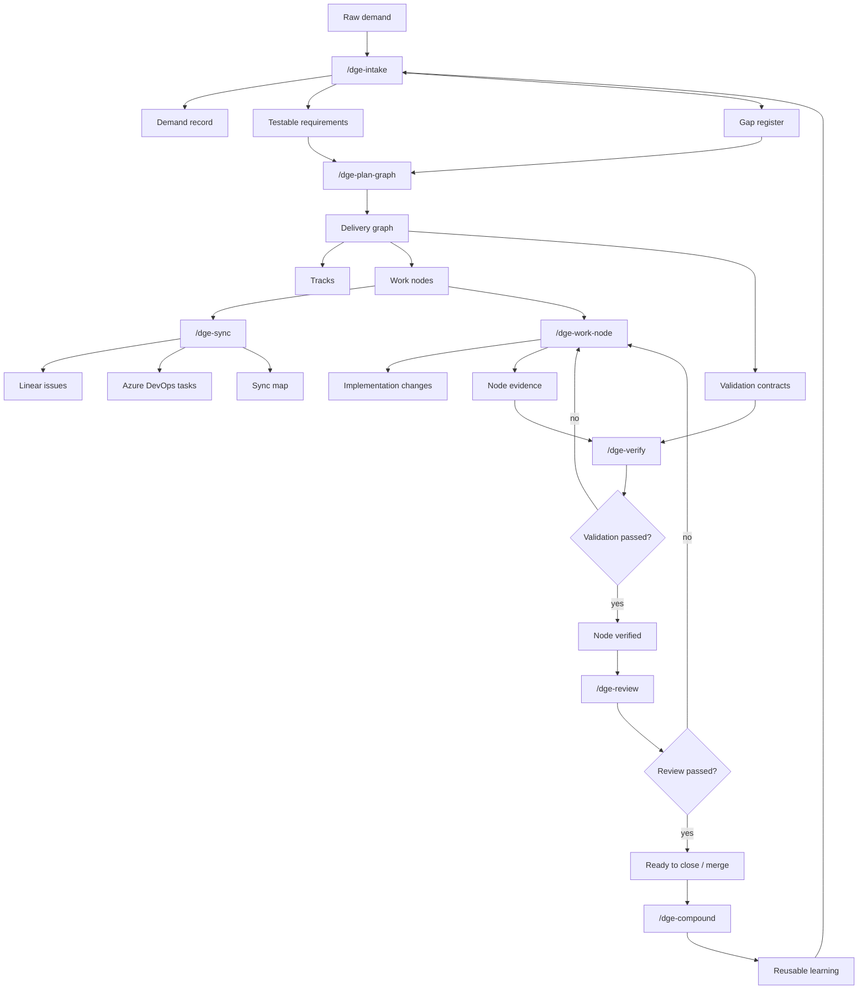

# Delivery Graph Engineering

Delivery Graph Engineering (DGE) turns raw demands into validated delivery graphs that agents can execute across harnesses and task trackers.

Instead of treating work as a linear checklist, DGE models delivery as a graph: demands become requirements, requirements become tracks and nodes, nodes carry dependencies and validation contracts, and external tools such as Linear or Azure DevOps stay synchronized as projections.

DGE is a **delivery operating system for coding agents**. It includes the general discipline every serious agentic workflow needs:

- clarify before coding
- plan before execution
- work in isolated units
- validate before completion
- review before merge
- capture learnings

But DGE adds stronger operational requirements:

- tasks become **nodes**
- nodes have **dependencies**
- nodes sync to **Linear or Azure DevOps**
- every node has a **validation contract**
- done requires **evidence**
- status is managed through a **state machine**
- the canonical artifact is **machine-readable**

The result is a workflow that is general enough to become a public methodology, but specific enough to support graph execution, evidence-gated completion, and task-tracker synchronization.

## Core idea

```text
Intake -> Requirements -> Graph -> Sync -> Work Node -> Verify -> Review -> Compound
   ^                                                                        |
   |------------------------------------------------------------------------|
```

The loop compounds because every completed node leaves behind validation evidence, decisions, reusable patterns, and follow-up context for the next demand.

## Quick start

Install DGE in the repository that should own the canonical `delivery-graph/` store:

```bash
npm install --save-dev github:rafaelolsr/delivery-graph
npx dge init --title "My delivery graph"
```

For local DGE development, run:

```bash
npm run check
```

This validates the example graph, renders a status report, and runs the tests.

## Local engine commands

The MVP includes a dependency-free local graph engine.

```bash
# Validate a graph
npm run validate

# Render graph status
npm run status

# Run engine tests
npm test

# Transition a node in a graph file
npm run transition -- examples/delivery-graph.example.json NODE-001 done
```

The transition command enforces the node state machine, dependency readiness, and validation evidence requirements.

## Authoring commands

Use the `dge` CLI to create and edit a local graph without hand-writing JSON.

```bash
# Create the canonical graph
npx dge init --title "Advisor eval regression gate"

# Add intake outputs
npx dge add-demand --title "Safer eval gates" --source "user" --outcome "Block quality regressions before merge"
npx dge add-requirement --demand DEM-001 --statement "PRs fail when eval quality drops" --acceptance "CI fails below threshold" --evidence "CI check output"
npx dge add-gap --type validation --severity blocker --question "What threshold blocks a PR?" --blocks REQ-001
npx dge resolve-gap GAP-001 --resolution "Use the current baseline threshold"

# Add plan graph outputs
npx dge add-track --title "Validation"
npx dge add-node --title "Add eval CI command" --type implementation --track TRK-validation --requirements REQ-001 --validation "npm test"

# Inspect and move work
npx dge status
npx dge transition NODE-001 in_progress

# Project ready nodes to Linear as a dry-run sync map
npx dge sync linear --team-id "<linear-team-id>"
```

By default, `dge` reads and writes `delivery-graph/graph.json`. Pass `--graph <path>` to target another graph file.

Linear sync writes `delivery-graph/sync/linear.json`. The current adapter is intentionally dry-run: it creates deterministic issue payloads and sync state without requiring credentials.

## Usable local loop

The local loop works without Linear, Azure DevOps, or any external tracker:

```bash
npx dge init --title "My delivery graph"
npx dge add-demand --title "Safer releases" --source "user" --outcome "Every completed node has proof"
npx dge add-requirement --demand DEM-001 --statement "Nodes require validation evidence" --acceptance "Verify fails without evidence" --evidence "Evidence manifest"
npx dge add-track --title "Validation"
npx dge add-node --title "Add evidence gate" --type test --track TRK-validation --requirements REQ-001 --validation "npm test"
npx dge evidence run NODE-001 --satisfies "npm test" -- npm test
npx dge done NODE-001
npx dge status
```

This creates:

```text
delivery-graph/
├── graph.json
├── demands/DEM-001.md
├── requirements/REQ-001.md
├── evidence/NODE-001/evidence.json
├── evidence/NODE-001/summary.md
├── evidence/NODE-001/verification.md
└── reports/review-<timestamp>.md
```

## Downstream battle test

DGE should be proven from a real consuming repository, not by creating all runtime artifacts inside this tool repository. Install DGE as a dev dependency in a separate project and use it to manage one real delivery demand end to end.

The battle test should prove:

- `/dge-intake` turns raw asks into explicit demands, testable requirements, and blocker gaps.
- `/dge-plan-graph` converts requirements into tracks, nodes, dependencies, and validation contracts.
- `/dge-work-node` keeps implementation scoped to one ready node.
- `/dge-verify` blocks completion until evidence exists and writes user-visible proof under `delivery-graph/evidence/NODE-<id>/verification.md`.
- `/dge-review` produces a durable review report under `delivery-graph/reports/`.

Run the battle test from the consuming repository:

```bash
cd /path/to/consuming-project
npm install --save-dev github:rafaelolsr/delivery-graph
npx dge init --title "Project delivery graph"
npx dge add-demand --title "..." --source "user" --outcome "..."
npx dge add-requirement --demand DEM-001 --statement "..." --acceptance "..." --evidence "..."
npx dge add-track --title "Validation"
npx dge add-node --title "..." --type implementation --track TRK-validation --requirements REQ-001 --validation "..."
npx dge evidence run NODE-001 --satisfies "..." -- <validation-command>
npx dge done NODE-001
```

Any friction found in that downstream run becomes DGE backlog. This keeps the plugin repository focused on the harness while real project work validates the methodology.

## Skill loop

| Skill | Purpose | Primary output |
| --- | --- | --- |
| `/dge-intake` | Brainstorm the demand, expose gaps, and create testable requirements | `delivery-graph/demands/`, `delivery-graph/requirements/` |
| `/dge-plan-graph` | Break requirements into tracks, nodes, dependencies, and validation contracts | `delivery-graph/graph.json` |
| `/dge-sync` | Create or update tracker records from graph nodes | Linear issues, ADO tasks, `delivery-graph/sync/` |
| `/dge-work-node` | Execute one ready atomic node | Code/docs changes plus node evidence |
| `/dge-verify` | Gate completion on validation evidence | `delivery-graph/evidence/` |
| `/dge-review` | Review implementation, graph state, unresolved risks, and validation coverage | `delivery-graph/reports/` |
| `/dge-compound` | Capture reusable learning for future loops | `delivery-graph/learnings/` |
| `/dge-status` | Render the current graph as a board/status view | terminal report, Linear view, markdown status |

## Workflow diagram



## Canonical store

DGE uses a single canonical store in the consuming repository:

```text
delivery-graph/
├── graph.json                 # Canonical graph: demands, requirements, tracks, nodes, edges
├── demands/                   # Raw demand records and clarified demand summaries
├── requirements/              # Testable requirements and acceptance criteria
├── evidence/                  # Validation evidence, grouped by node id
├── sync/                      # External tracker ids, sync state, conflict notes
├── reports/                   # Status, review, verification, and delivery reports
└── learnings/                 # Compounded reusable knowledge from completed work
```

Linear, Azure DevOps, GitHub Issues, and markdown boards are projections of this store. They can be updated from the graph, but they should not silently replace the graph as the source of truth.

## Deliverable asset locations

| Asset | Saved in | Created by |
| --- | --- | --- |
| Demand record | `delivery-graph/demands/DEM-<id>.md` | `/dge-intake` |
| Requirements | `delivery-graph/requirements/REQ-<id>.md` | `/dge-intake` |
| Gap register | `delivery-graph/graph.json` under `gaps` | `/dge-intake` |
| Canonical graph | `delivery-graph/graph.json` | `/dge-plan-graph` |
| Linear sync map | `delivery-graph/sync/linear.json` | `/dge-sync` |
| ADO sync map | `delivery-graph/sync/ado.json` | `/dge-sync` |
| Node evidence | `delivery-graph/evidence/NODE-<id>/` | `/dge-verify` |
| Review report | `delivery-graph/reports/review-<timestamp>.md` | `/dge-review` |
| Status report | `delivery-graph/reports/status-<timestamp>.md` | `/dge-status` |
| Learning note | `delivery-graph/learnings/<slug>.md` | `/dge-compound` |

## Tracker mapping

| DGE object | Linear projection | Azure DevOps projection |
| --- | --- | --- |
| Demand | Project or Initiative | Feature or Epic |
| Requirement | Milestone, label, or parent issue | User Story / PBI |
| Track | Project view, label, or cycle | Area grouping or parent task set |
| Work node | Issue | Task |
| Atomic node | Sub-issue | Child task |
| Dependency edge | Blocks / blocked-by relation | Related / predecessor link |
| Validation contract | Checklist/comment | Acceptance criteria/checklist |
| Evidence | Comment, attachment, PR/check link | Discussion, attachment, test evidence |

## Node lifecycle

```text
proposed -> ready -> in_progress -> blocked -> review -> verified -> done
```

A node can only move to `done` when:

1. All dependencies are complete.
2. Required validation has passed.
3. Evidence is attached under `delivery-graph/evidence/NODE-<id>/`.
4. Tracker state is synchronized.
5. Review findings are resolved or explicitly deferred.

## Repository layout

This repository will contain the plugin source and shared contracts:

```text
.
├── README.md                  # Project overview and workflow contract
├── assets/                    # Plugin icons, diagrams, and public assets
├── adapters/                  # Linear, ADO, GitHub, and local-store adapters
├── docs/                      # Design notes, ADRs, and usage guides
├── examples/                  # Example delivery graphs and generated outputs
├── manifests/                 # Draft manifests for supported harnesses
├── schemas/                   # Graph schemas and validation contracts
├── scripts/                   # Local validation and status tooling
├── src/                       # Core graph engine and renderers
├── tests/                     # Engine tests
└── skills/                    # Multi-harness skill definitions
```

## MVP scope

The first deliverable should prove one complete loop:

1. `/dge-intake` creates one demand with requirements and gaps.
2. `/dge-plan-graph` creates a graph with tracks, nodes, dependencies, and validation contracts.
3. `/dge-sync` creates Linear issues from ready nodes.
4. `/dge-work-node` executes one node.
5. `/dge-verify` attaches evidence and blocks completion if validation is missing.

After that loop works, add ADO sync, review automation, compounding, and additional harness manifests.
